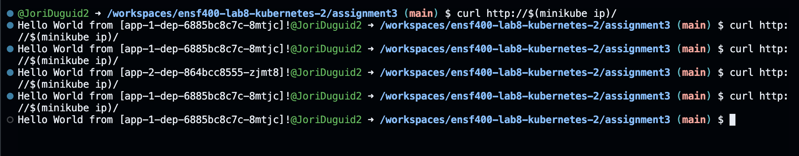
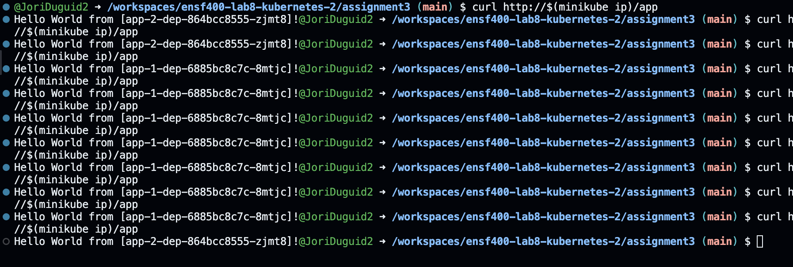

# Assignment 3

## Author: Jori Duguid

## Instructions To Run In Order

minikube start

kubectl apply -f nginx-configmap.yaml

kubectl apply -f nginx-dep.yaml

kubectl apply -f nginx-svc.yaml

kubectl apply -f nginx-ingress.yaml

kubectl apply -f app-1-dep.yaml

kubectl apply -f app-1-svc.yaml

kubectl apply -f app-1-ingress.yaml

kubectl apply -f app-2-dep.yaml

kubectl apply -f app-2-svc.yaml

kubectl apply -f app-2-ingress.yaml

## To Test Functionality...

Run the command: 

curl http://$(minikube ip)/app

## Requirement Meeting

### Nginx Deployment:

File: nginx-dep.yaml

Description: Deploy Nginx with 5 replicas, using version 1.14.2, and expose port 80.

Details: All requirements are met inside the nginx-dep.yaml file.

### ConfigMap for Nginx:

File: nginx-configmap.yaml

Description: ConfigMap with Nginx configuration details, mounted on the Nginx Deployment.

Details: The ConfigMap with the Nginx configuration details can be found in the nginx-configmap.yaml file. It is mounted to the Nginx configuration in the nginx-dep.yaml file.

### Nginx Service:

File: nginx-svc.yaml

Description: Service selecting pods from the Nginx Deployment.

Details: The pods from the Nginx deployment are selected, and the service is exposed on port 80.

### Nginx Ingress:

File: nginx-ingress.yaml

Description: Ingress file redirecting requests to the "/" path to the Nginx service.

Details: The nginx-ingress.yaml file redirects requests to the "/" path to the nginx-svc service.

### App-1 and App-2 Deployment and Service:

Files: app-1-dep.yaml, app-1-svc.yaml, app-2-dep.yaml, app-2-svc.yaml

Description: Write deployment and service files for App-1 and App-2.

Details: Deployment and service files for App-1 and App-2 can be found in the respective files.

### Canary Deployment Ingress:

Files: app-1-ingress.yaml, app-2-ingress.yaml

Description: Ingress files setting up Canary deployment, redirecting 70% of requests to App-1 and 30% to App-2.

Details: The app-1-ingress.yaml and app-2-ingress.yaml files redirect 70% of requests to /app to App-1 and 30% to App-2 using a Canary deployment.

## Screenshots

Output for nginx service;

Output for Canary deployment showing 70% app1 and 30% app2:

